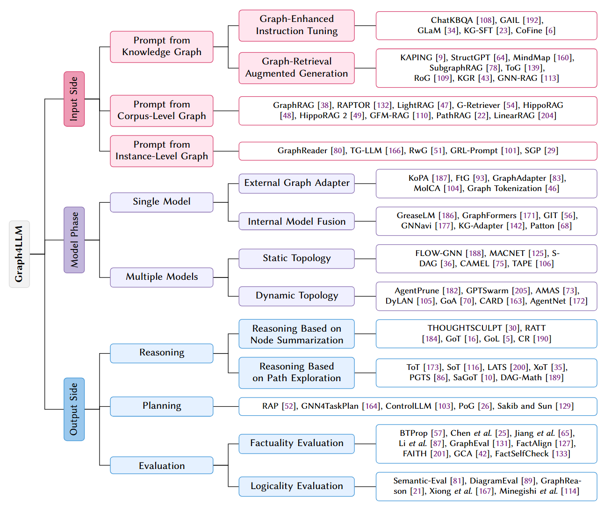
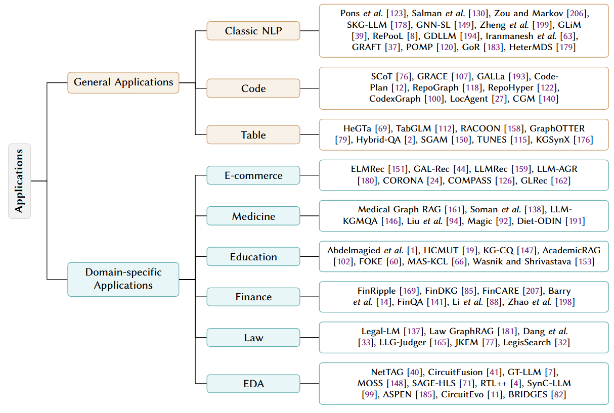
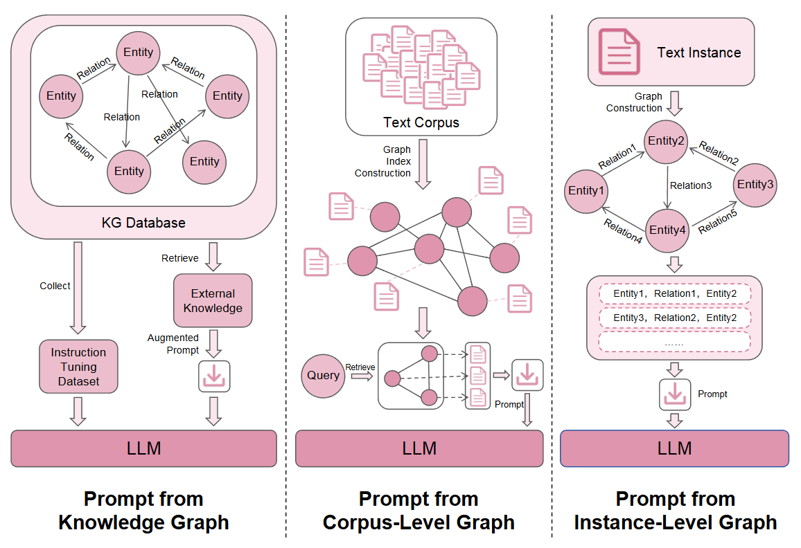
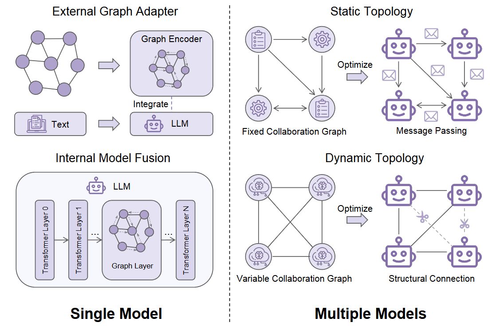
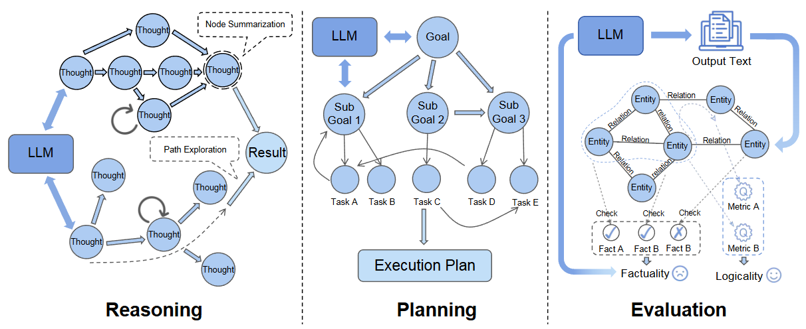

# Awesome-Graph4LLM

This repository contains a curated list of resources on graph-enhanced large language models (**Graph4LLM**).

The link to the paper is as follows: [Are Graphs Useful for LLMs? A Comprehensive Survey of Graph-Enhanced Large Language Models](http://shichuan.org/doc/225.pdf)

## Overview

This paper presents a systematic and pipeline-oriented survey of **Graph4LLM**. We categorize existing Graph4LLM methods according to the three core phases of the LLM pipeline: input phase, where graphs structure prompts and incorporate external knowledge; model phase, where graphs guide internal computation or multi-agent coordination; and output phase, where graphs support structured reasoning, planning and verification. For each phase, we conduct a detailed review of key methods and their design trade-offs, further elaborate on the broad application scenarios of Graph4LLM in general tasks and specific domains, and finally outline the critical challenges and promising future research directions for this field.

## Research Papers

### 📑 Table of Contents
- [Awesome-Graph4LLM](#awesome-graph4llm)
  - [Overview](#overview)
  - [Research Papers](#research-papers)
    - [📑 Table of Contents](#-table-of-contents)
  - [🔹 Input Phase](#-input-phase)
    - [Prompt from Knowledge Graph](#prompt-from-knowledge-graph)
      - [Graph-Enhanced Instruction Tuning](#graph-enhanced-instruction-tuning)
      - [Graph-Retrieval Augmented Generation](#graph-retrieval-augmented-generation)
    - [Prompt from Corpus-Level Graph](#prompt-from-corpus-level-graph)
    - [Prompt from Instance-Level Graph](#prompt-from-instance-level-graph)
  - [🔹 Model Phase](#-model-phase)
    - [Single Model](#single-model)
      - [External Graph Adapter](#external-graph-adapter)
      - [Internal Model Fusion](#internal-model-fusion)
    - [Multiple Models](#multiple-models)
      - [Static Topology](#static-topology)
      - [Dynamic Topology](#dynamic-topology)
  - [🔹 Output Phase](#-output-phase)
    - [Reasoning](#reasoning)
      - [Reasoning Based on Node Summarization](#reasoning-based-on-node-summarization)
      - [Reasoning Based on Path Exploration](#reasoning-based-on-path-exploration)
    - [Planning](#planning)
    - [Evaluation](#evaluation)
      - [Factuality Evaluation](#factuality-evaluation)
      - [Logicality Evaluation](#logicality-evaluation)
  - [🚀 Applications of Graph4LLM](#-applications-of-graph4llm)
    - [🔹 General Applications](#-general-applications)
      - [Classic NLP](#classic-nlp)
      - [Code](#code)
      - [Table](#table)
    - [🔹 Domain-Specific Applications](#-domain-specific-applications)
      - [E-Commerce](#e-commerce)
      - [Medicine](#medicine)
      - [Education](#education)
      - [Finance](#finance)
      - [Law](#law)
      - [EDA](#eda)

## 🔹 Input Phase

### Prompt from Knowledge Graph

#### Graph-Enhanced Instruction Tuning

- (ACL 2024) **ChatKBQA: A Generate-then-Retrieve Framework for Knowledge Base Question Answering** [[Paper]](https://arxiv.org/abs/2310.08975)
- (CIKM 2024) **A GAIL Fine-Tuned LLM Enhanced Framework for Low-Resource Knowledge Graph Question Answering** [[Paper]](https://dl.acm.org/doi/10.1145/3627673.3679753)
- (AAAI-MAKE 2024) **GLaM: Fine-Tuning Large Language Models for Domain Knowledge Graph Alignment via Neighborhood Partitioning and Generative Subgraph Encoding** [[Paper]](https://arxiv.org/abs/2402.06764)
- (ICLR 2025) **Knowledge Graph Finetuning Enhances Knowledge Manipulation in Large Language Models** [[Paper]](https://iclr.cc/virtual/2025/poster/28362)
- (ESWA 2025) **Exploiting knowledge graph communities to fine-tune large language models** [[Paper]](https://doi.org/10.1016/j.eswa.2025.129816)

#### Graph-Retrieval Augmented Generation
- (NLRSE 2023) **Knowledge-Augmented Language Model Prompting for Zero-Shot Knowledge Graph Question Answering** [[Paper]](https://arxiv.org/abs/2306.04136)
- (EMNLP 2023) **StructGPT: A General Framework for Large Language Model to Reason over Structured Data** [[Paper]](https://aclanthology.org/2023.emnlp-main.574/)
- (ACL 2024) **MindMap: Knowledge Graph Prompting Sparks Graph of Thoughts in Large Language Models** [[Paper]](https://aclanthology.org/2024.acl-long.558/)
- (ICLR 2025) **Simple is Effective: The Roles of Graphs and Large Language Models in Knowledge-Graph-Based Retrieval-Augmented Generation** [[Paper]](https://arxiv.org/abs/2410.20724)
- (ICLR 2024) **Think-on-Graph: Deep and Responsible Reasoning of Large Language Model on Knowledge Graph** [[Paper]](https://arxiv.org/abs/2307.07697)
- (ICLR 2024) **Reasoning on Graphs: Faithful and Interpretable Large Language Model Reasoning** [[Paper]](https://arxiv.org/abs/2310.01061)
- (AAAI 2024) **Mitigating Large Language Model Hallucinations via Autonomous Knowledge Graph-Based Retrofitting** [[Paper]](https://arxiv.org/abs/2311.13314)
- (ACL 2025) **GNN-RAG: Graph Neural Retrieval for Large Language Model Reasoning** [[Paper]](https://aclanthology.org/2025.findings-acl.856/)

### Prompt from Corpus-Level Graph

- (ArXiv 2024) **From Local to Global: A GraphRAG Approach to Query-Focused Summarization** [[Paper]](https://arxiv.org/abs/2404.16130)
- (ICLR 2024) **RAPTOR: Recursive Abstractive Processing for Tree-Organized Retrieval** (RAPTOR) [[Paper]](https://arxiv.org/abs/2401.18059)
- (EMNLP 2025) **LightRAG: Simple and Fast Retrieval-Augmented Generation** [[Paper]](https://aclanthology.org/2025.findings-emnlp.568/)
- (NeurIPS 2024) **G-Retriever: Retrieval-Augmented Generation for Textual Graph Understanding and Question Answering** [[Paper]](https://proceedings.neurips.cc/paper_files/paper/2024/hash/efaf1c9726648c8ba363a5c927440529-Abstract-Conference.html)
- (NeurIPS 2024) **HippoRAG: Neurobiologically Inspired Long-Term Memory for Large Language Models** [[Paper]](https://arxiv.org/abs/2405.14831)
- (ICML 2025) **HippoRAG2: From RAG to Memory: Non-Parametric Continual Learning for Large Language Models** [[Paper]](https://arxiv.org/abs/2502.14802)
- (NeurIPS 2025) **GFM-RAG: Graph Foundation Model for Retrieval Augmented Generation** [[Paper]](https://arxiv.org/abs/2502.01113)
- (AAAI 2026) **PathRAG: Pruning Graph-Based Retrieval Augmented Generation with Relational Paths** [[Paper]](https://arxiv.org/abs/2502.14902)
- (ICLR 2026) **LinearRAG: Linear Graph Retrieval Augmented Generation on Large-scale Corpora** [[Paper]](https://openreview.net/forum?id=mCtfkypdm6)

### Prompt from Instance-Level Graph
- (ACL 2024) **GraphReader: Building Graph‑based Agent to Enhance Long‑Context Abilities of Large Language Models** [[Paper]](https://arxiv.org/abs/2406.14550) 
- (ACL 2024) **Large Language Models Can Learn Temporal Reasoning** [[Paper]](https://aclanthology.org/2024.acl-long.563) 
- (ACL 2025) **Reasoning with Graphs: Structuring Implicit Knowledge to Enhance LLMs Reasoning** [[Paper]](https://aclanthology.org/2025.findings-acl.1319/)
- (PAKDD 2025) **GRL‑Prompt: Towards Knowledge Graph based Prompt Optimization via Reinforcement Learning** [[Paper]](https://arxiv.org/abs/2411.14479)
- (EMNLP 2024) **Structure Guided Prompt: Instructing Large Language Model in Multi‑Step Reasoning by Exploring Graph Structure of the Text** [[Paper]](https://arxiv.org/abs/2402.13415)

---

## 🔹 Model Phase

### Single Model

#### External Graph Adapter
- (MM 2023) **Making Large Language Models Perform Better in Knowledge Graph Completion** [[Paper]](https://arxiv.org/abs/2310.06671)
- (COLING 2025) **Filter‑then‑Generate: Large Language Models with Structure‑Text Adapter for Knowledge Graph Completion** [[Paper]](https://aclanthology.org/2025.coling-main.740/)
- (EMNLP 2024) **GraphAdapter: Tuning Vision‑Language Models With Dual Knowledge Graph** [[Paper]](https://arxiv.org/abs/2309.13625)
- (EMNLP 2023) **MolCA: Molecular Graph‑Language Modeling with Cross‑Modal Projector and Uni‑Modal Adapter** [[Paper]](https://aclanthology.org/2023.emnlp-main.966/)
- (ICLR 2026) **Graph Tokenization for Bridging Graphs and Transformers** [[Paper]](https://openreview.net/forum?id=jCctxI1BGF)

#### Internal Model Fusion
- (ICLR 2022) **GreaseLM: Graph REASoning Enhanced Language Models** [[Paper]](https://arxiv.org/abs/2201.08860)
- (NeurIPS 2021) **GraphFormers: GNN‑nested Transformers for Representation Learning on Textual Graph** [[Paper]](https://proceedings.neurips.cc/paper/2021/hash/f18a6d1cde4b205199de8729a6637b42-Abstract.html)
- (EMNLP 2022) **Graph‑Induced Transformers for Efficient Multi‑Hop Question Answering**[[Paper]](https://aclanthology.org/2022.emnlp-main.650/)  
- (ACL 2024) **GNNAVI: Navigating the Information Flow in Large Language Models by Graph Neural Network** [[Paper]](https://arxiv.org/abs/2402.11709)
- (ACL 2024 Findings) **KG‑Adapter: Enabling Knowledge Graph Integration in Large Language Models through Parameter‑Efficient Fine‑Tuning** (KG‑Adapter) [[Paper]](https://aclanthology.org/2024.findings-acl.229/)
- (ACL 2023) **Patton: Language Model Pretraining on Text‑Rich Networks** (Patton) [[Paper]](https://aclanthology.org/2023.acl-long.387/) 

### Multiple Models

#### Static Topology

- (LOG 2025) **FLORA: GNNs as Predictors of Agentic Workflow Performances** [[Paper]](https://arxiv.org/abs/2503.11301)  
- (ICLR 2025) **Scaling Large Language Model‑based Multi‑Agent Collaboration** [[Paper]](https://openreview.net/forum?id=K3n5jPkrU6)
- (NeurIPS 2023) **CAMEL: Communicative Agents for “Mind” Exploration of Large Language Model Society** [[Paper]](https://arxiv.org/abs/2303.17760) 
- (AAAI 2026) **S‑DAG: A Subject‑Based Directed Acyclic Graph for Multi‑Agent Heterogeneous Reasoning** [[Paper]](https://ojs.aaai.org/index.php/AAAI/article/view/40180)
- (AAAI 2024) **TAPE: Leveraging Agent Topology for Cooperative Multi‑Agent Policy Gradient** [[Paper]](https://ojs.aaai.org/index.php/AAAI/article/view/29699/31197)

#### Dynamic Topology

- (ICLR 2025) **Cut the Crap: An Economical Communication Pipeline for LLM‑based Multi‑Agent Systems** [[Paper]](https://openreview.net/forum?id=LkzuPorQ5L) 
- (ICML 2024) **GPTSwarm: Language Agents as Optimizable Graphs** [[Paper]](https://arxiv.org/abs/2402.16823) 
- (EMNLP 2025) **AMAS: Adaptively Determining Communication Topology for LLM‑based Multi‑Agent System** [[Paper]](https://aclanthology.org/2025.emnlp-industry.144/)
- (COLM 2024) **A Dynamic LLM‑Powered Agent Network for Task‑Oriented Agent Collaboration** [[Paper]](https://openreview.net/forum?id=XII0Wp1XA9)
- (ICLR 2026) **Graph‑of‑Agents: A Graph‑based Framework for Multi‑Agent LLM Collaboration** [[Paper]](https://openreview.net/forum?id=34cANdsHKV)
- (ICLR 2026) **CARD: Towards Conditional Design of Multi‑Agent Topological Structures** [[Paper]](https://arxiv.org/abs/2603.01089) 
- (NeurIPS 2025) **AgentNet: Decentralized Evolutionary Coordination for LLM‑based Multi‑Agent Systems** [[Paper]](https://neurips.cc/virtual/2025/poster/115584)
---

## 🔹 Output Phase

### Reasoning

#### Reasoning Based on Node Summarization
- (NACCL 2025) **THOUGHTSCULPT: Reasoning with Intermediate Revision and Search** [[Paper]](https://arxiv.org/abs/2404.05966)  
- (AAAI 2025) **RATT: A Thought Structure for Coherent and Correct LLM Reasoning** [[Paper]](https://arxiv.org/abs/2406.02746)  
- (AAAI 2024) **Graph of Thoughts: Solving Elaborate Problems with Large Language Models** [[Paper]](https://www.arxiv.org/abs/2308.09687)  
- (BigData 2024) **Graph of Logic: Enhancing LLM Reasoning with Graphs and Symbolic Logic** [[Paper]](https://ieeexplore.ieee.org/document/10825450)  
- (TMLR 2025) **Cumulative Reasoning with Large Language Models** [[Paper]](https://arxiv.org/abs/2308.04371) 

#### Reasoning Based on Path Exploration
- (NeurIPS 2023) **Tree of Thoughts: Deliberate Problem Solving with Large Language Models** [[Paper]](https://arxiv.org/abs/2305.10601)  
- (ICLR 2024) **Skeleton‑of‑Thought: Prompting LLMs for Efficient Parallel Generation** [[Paper]](https://arxiv.org/abs/2307.15337)  
- (ICML 2024) **Language Agent Tree Search Unifies Reasoning, Acting, and Planning in Language Models** [[Paper]](https://arxiv.org/abs/2310.04406)  
- (ACL 2024) **Everything of Thoughts: Defying the Law of Penrose Triangle for Thought Generation** [[Paper]](https://arxiv.org/abs/2311.04254)  
- (ICML 2025) **Policy Guided Tree Search for Enhanced LLM Reasoning** [[Paper]](https://arxiv.org/abs/2502.06813)  
- (ACL 2025 Findings) **Self‑attention‑based Graph‑of‑Thought for Math Problem Solving** [[Paper]](https://aclanthology.org/2025.findings-acl.317) 
- (ICLR 2026) **DAG‑Math: Graph‑Guided Mathematical Reasoning in LLMs** [[Paper]](https://openreview.net/forum?id=ylr6WArKQN) 

### Planning
- (EMNLP 2023) **Reasoning with Language Model is Planning with World Model** [[Paper]](https://arxiv.org/abs/2305.14992)  
- (NeurIPS 2024) **Can Graph Learning Improve Planning in LLM‑based Agents?** [[Paper]](https://www.arxiv.org/abs/2405.19119)  
- (ECCV 2024) **ControlLLM: Augment Language Models with Tools by Searching on Graphs** [[Paper]](https://arxiv.org/abs/2310.17796)
- (NeurIPS 2024) **Plan‑on‑Graph: Self‑Correcting Adaptive Planning of Large Language Model on Knowledge Graphs** [[Paper]](https://arxiv.org/abs/2410.23875)  
- (IJAIRR 2024) **Consolidating Trees of Robotic Plans Generated Using Large Language Models to Improve Reliability** [[Paper]](https://arxiv.org/abs/2401.07868)  

### Evaluation

#### Factuality Evaluation

- (NAACL 2025) **A Probabilistic Framework for LLM Hallucination Detection via Belief Tree Propagation** [[Paper]](https://aclanthology.org/2025.naacl-long.158)  
- (AAAI 2025) **Enhancing Uncertainty Modeling with Semantic Graph for Hallucination Detection** [[Paper]](https://arxiv.org/abs/2501.02020)
- (ArXiv 2024) **Graph‑based Uncertainty Metrics for Long‑form Language Model Outputs** [[Paper]](https://arxiv.org/abs/2410.20783) 
- (ArXiv 2024) **Graph‑based Confidence Calibration for Large Language Models** [[Paper]](https://arxiv.org/abs/2411.02454) 
- (KiL 2024) **GraphEval: A Knowledge‑Graph Based LLM Hallucination Evaluation Framework** [[Paper]](https://arxiv.org/abs/2407.10793)  
- (TrustNLP 2024) **FactAlign: Fact‑Level Hallucination Detection and Classification Through Knowledge Graph Alignment** [[Paper]](https://aclanthology.org/2024.trustnlp-1.8)  
- (AAAI 2026) **Assessing Automated Fact‑Checking for Medical LLM Responses with Knowledge Graphs** [[Paper]](https://arxiv.org/abs/2511.12817)  
- (AAAI 2025) **Zero‑resource Hallucination Detection for Text Generation via Graph‑based Contextual Knowledge Triples Modeling** [[Paper]](https://arxiv.org/abs/2409.11283)  
- (EACL 2026) **FactSelfCheck: Fact‑Level Black‑Box Hallucination Detection for LLMs** [[Paper]](https://arxiv.org/abs/2503.17229)  

#### Logicality Evaluation

- (ACL 2025) **Semantic‑Eval: A Semantic Comprehension Evaluation Framework for Large Language Models Generation without Training** [[Paper]](https://aclanthology.org/2025.acl-long.477)
- (EMNLP 2025) **DiagramEval: Evaluating LLM‑Generated Diagrams via Graphs** [[Paper]](https://aclanthology.org/2025.emnlp-main.640)
- (ACL 2024) **GraphReason: Enhancing Reasoning Capabilities of Large Language Models through a Graph‑Based Verification Approach** [[Paper]](https://aclanthology.org/2024.nlrse-1.1)
- (EMNLP 2025) **Mapping the Minds of LLMs: A Graph‑Based Analysis of Reasoning LLMs** [[Paper]](https://aclanthology.org/2025.emnlp-main.896) 
- (NeurIPS 2025) **Topology of Reasoning: Understanding Large Reasoning Models through Reasoning Graph Properties** [[Paper]](https://arxiv.org/abs/2506.05744)

---

## 🚀 Applications of Graph4LLM

### 🔹 General Applications

#### Classic NLP
- (ISWC 2024) **Knowledge Graphs for Enhancing Large Language Models in Entity Disambiguation** [[Paper]](https://arxiv.org/abs/2505.02737)
- (CCKS-IJCKG 2024) **An LLM-SPARQL Hybrid Framework for Named Entity Linking and Disambiguation to Wikidata** [[Paper]](https://link.springer.com/chapter/10.1007/978-981-96-1809-5_16)
- (ACL 2024 (Findings)) **GNNAVI: Navigating the Information Flow in Large Language Models by Graph Neural Network** [[Paper]](https://aclanthology.org/2024.findings-acl.237)
- (AIMSA 2024) **Combining Graph NN and LLM for Improved Text-Based Emotion Recognition** [[Paper]](https://link.springer.com/chapter/10.1007/978-3-031-81542-3_12)
- (KSEM 2025) **SKG-LLM: Enhancing Large Language Models with Sentiment Knowledge Graphs for Fine-Grained Sentiment Analysis** [[Paper]](https://link.springer.com/chapter/10.1007/978-981-95-3061-8_30)
- (ACL 2023) **GNN-SL: Sequence Labeling Based on Nearest Examples via GNN** [[Paper]](https://arxiv.org/abs/2212.02017)
- (ACL 2022) **Cross-domain Named Entity Recognition via Graph Matching** [[Paper]](https://arxiv.org/abs/2408.00981)
- (ECCC 2025) **LLM-assisted Graph-RAG Information Extraction from IFC Data** [[Paper]](https://arxiv.org/abs/2504.16813)
- (ACL 2025 (Findings)) **GLiM: Integrating Graph Transformer and LLM for Document-Level Biomedical Relation Extraction with Incomplete Labeling** [[Paper]](https://aclanthology.org/2025.findings-acl.727)
- (CIKM 2025) **RePooL: Relation-Faceted Graph Pooling with LLM Guidance for Dynamic Span-Aware Information Extraction** [[Paper]](https://dl.acm.org/doi/abs/10.1145/3746252.3761243)
- (EMNLP 2025) **GDLLM: A Global Distance-aware Modeling Approach Based on Large Language Models for Event Temporal Relation Extraction** [[Paper]](https://arxiv.org/abs/2508.20828)
- (EMNLP 2025) **GRAFT: A Graph-based Flow-aware Agentic Framework for Document-level Machine Translation** [[Paper]](https://arxiv.org/abs/2507.03311)
- (ACL 2024) **POMP: Probability-driven Meta-graph Prompter for LLMs in Low-resource Unsupervised Neural Machine Translation** [[Paper]](https://aclanthology.org/2024.acl-long.537)
- (ACL 2025) **Graph of Records: Boosting Retrieval Augmented Generation for Long-context Summarization with Graphs** [[Paper]](https://arxiv.org/abs/2410.11001)
- (TCDS 2024) **Adaptive Multidocument Summarization Via Graph Representation Learning** [[Paper]](https://ieeexplore.ieee.org/stamp/stamp.jsp?tp=&arnumber=10804563)

#### Code

- (TSEM 2025) **Structured Chain-of-Thought Prompting for Code Generation** [[Paper]](https://arxiv.org/pdf/2305.06599)
- (JSS 2024) **GRACE: Empowering LLM-based software vulnerability detection with graph structure and in-context learning** [[Paper]](https://ntu-juking.github.io/files/JSS-2024-01-Self.pdf)
- (ACL 2025) **GALLa: Graph Aligned Large Language Models for Improved Source Code Understanding** [[Paper]](https://arxiv.org/pdf/2409.04183)
- (FSE 2024) **CodePlan: Repository-Level Coding using LLMs and Planning** [[Paper]](https://arxiv.org/pdf/2309.12499)
- (ICLR 2025) **RepoGraph: Enhancing AI Software Engineering with Repository-level Code Graph** [[Paper]](https://arxiv.org/pdf/2410.14684)
- (FORGE 2025) **RepoHyper: Search-Expand-Refine on Semantic Graphs for Repository-Level Code Completion** [[Paper]](https://arxiv.org/pdf/2403.06095)
- (ACL 2025) **CodexGraph: Bridging Large Language Models and Code Repositories via Code Graph Databases** [[Paper]](https://arxiv.org/pdf/2408.03910)
- (ACL 2025) **LocAgent: Graph-Guided LLM Agents for Code Localization** [[Paper]](https://arxiv.org/pdf/2503.09089)
- (NeurIPS 2025) **Code Graph Model (CGM): A Graph-Integrated Large Language Model for Repository-Level Software Engineering Tasks** [[Paper]](https://arxiv.org/pdf/2505.16901)

#### Table

- (AAAI 2025) **HeGTa: Leveraging Heterogeneous Graph-enhanced Large Language Models for Few-shot Complex Table Understanding** [[Paper]](https://arxiv.org/pdf/2403.19723)
- (AAAI 2025) **TabGLM: Tabular Graph Language Model for Learning Transferable Representations Through Multi-Modal Consistency Minimization** [[Paper]](https://arxiv.org/pdf/2502.18847)
- (TRL @ NeurIPS 2024) **RACOON: An LLM-based Framework for Retrieval-Augmented Column Type Annotation with a Knowledge Graph** [[Paper]](https://arxiv.org/pdf/2409.14556)
- (COLING 2025) **GraphOTTER: Evolving LLM-based Graph Reasoning for Complex Table Question Answering** [[Paper]](https://arxiv.org/pdf/2412.01230)
- (NAACL 2025) **Hybrid Graphs for Table-and-Text based Question Answering using LLMs** [[Paper]](https://arxiv.org/pdf/2501.17767v1)
- (EMNLP 2025) **Plugging schema graph into multi-table qa: A human-guided framework for reducing llm reliance** [[Paper]](https://arxiv.org/pdf/2501.17767)
- (COLM 2025) **Improving Table Understanding with LLMs and EntityOriented Search** [[Paper]](https://arxiv.org/pdf/2508.17028)
- (ISWC 2025) **KGSynX: Knowledge Graph and Explainable Feedback Guided LLMs for Synthetic Tabular Data Generation** [[Paper]](https://ceur-ws.org/Vol-4085/paper34.pdf)

### 🔹 Domain-Specific Applications

#### E-Commerce

- (EMNLP 2024) **Enhancing High-order Interaction Awareness in LLM-based Recommender Model** [[Paper]](https://arxiv.org/pdf/2409.19979)
- (WSDM 2025, ACM International Conference on Web Search and Data Mining) **Enhancing Collaborative Semantics of Language Model-Driven Recommendations via Graph-Aware Learning** [[Paper]](https://arxiv.org/pdf/2406.13235)
- (WSDM 2024) **LLMRec: Large Language Models with Graph Augmentation for Recommendation** [[Paper]](https://dl.acm.org/doi/abs/10.1145/3616855.3635853)
- (KBS 2025) **LLM-AGR: Large Language Model Augmented Graph Representation Learning for Recommendation** [[Paper]](https://www.sciencedirect.com/science/article/pii/S0950705125018295)
- (SIGIR 2025) **CORONA: A Coarse-to-Fine Framework for Graph-based Recommendation with Large Language Models** [[Paper]](https://arxiv.org/pdf/2407.10747)
- (ICDM 2025) **Reasoning over User Preferences: Knowledge Graph-Augmented LLMs for Explainable Conversational Recommendations** [[Paper]](https://arxiv.org/pdf/2411.14459)
- (AAAI 2025) **Exploring large language model for graph data understanding in online job recommendations** [[Paper]](https://arxiv.org/pdf/2307.05722)

#### Medicine

- (ACL 2025) **Medical Graph RAG: Evidence-based Medical Large Language Model via Graph Retrieval-Augmented Generation** [[Paper]](https://arxiv.org/pdf/2408.04187)
- (Bioinformatics 2024) **Biomedical knowledge graph-optimized prompt generation for large language models** [[Paper]](https://academic.oup.com/bioinformatics/article/40/9/btae560/7759620)
- (KAIS 2025) **LLM-KGMQA: large language model-augmented multi-hop question-answering system based on knowledge graph in medical field** [[Paper]](https://link.springer.com/article/10.1007/s10115-025-02072-9)
- (ICLR 2025) **Multimodal Large Language Models for Inverse Molecular Design with Retrosynthetic Planning** [[Paper]](https://arxiv.org/pdf/2410.04223)
- (Information Fusion 2026) **Magic: AN LLM-based multi-agent activated graph-reasoning intelligent collaboration model for liver disease diagnosis** [[Paper]](https://www.sciencedirect.com/science/article/pii/S1566253525006293)
- (KDD 2024) **Diet-ODIN: A Novel Framework for Opioid Misuse Detection with Interpretable Dietary Patterns** [[Paper]](https://arxiv.org/pdf/2403.08820)

#### Education
- (EMOOCs 2025) **Leveraging Graph Retrieval-Augmented Generation to Support Learners’ Understanding of Knowledge Concepts in MOOCs** [[Paper]](https://arxiv.org/pdf/2505.10074)
- (AIQAM 2024) **Cross-data knowledge graph construction for LLM-enabled educational question-answering system: A case study at HCMUT** [[Paper]](https://arxiv.org/abs/2404.09296)
- (MDPI 2025) **Synergizing Knowledge Graphs and LLMs: An Intelligent Tutoring Model for Self-Directed Learning** [[Paper]](https://www.mdpi.com/2227-7102/15/9/1102)
- (CAAI 2024) **FOKE: A Personalized and Explainable Education Framework Integrating Foundation Models, Knowledge Graphs, and Prompt Engineering** [[Paper]](https://arxiv.org/pdf/2405.03734)
- (The Visual Computer 2025) **MAS-KCL: knowledge component graph structure learning with large language model-based agentic workflow** [[Paper]](https://arxiv.org/pdf/2505.14126)
- (ICCPCT 2025) **Adaptive Machine Learning Frameworks Integrating LLMs and Knowledge Graphs for Tailored Education** [[Paper]](https://ieeexplore.ieee.org/abstract/document/11176710)

#### Finance
- (ACL 2025) **FinRipple: Aligning Large Language Models with Financial Market for Event Ripple Effect Awareness** [[Paper]](https://arxiv.org/pdf/2505.23826)
- (ICAIF 2024) **FinDKG: Dynamic Knowledge Graphs with Large Language Models for Detecting Global Trends in Financial Markets** [[Paper]](https://arxiv.org/pdf/2407.10909)
- (GenAI in Finance 2025) **FinCARE: Financial Causal Analysis with Reasoning and Evidence** [[Paper]](https://arxiv.org/pdf/2510.20221)
- (GenAI-K 2025) **GraphRAG: Leveraging Graph-Based Efficiency to Minimize Hallucinations in LLM-Driven RAG for Finance Data** [[Paper]](https://aclanthology.org/2025.genaik-1.6.pdf)
- (ECML PKDD 2024) **FinQA: A Training-Free Dynamic Knowledge Graph Question Answering System in Finance with LLM-Based Revision** [[Paper]](https://ecmlpkdd-storage.s3.eu-central-1.amazonaws.com/preprints/2024/lncs14948/lncs14948418.pdf)
- (DECS 2025) **Construction of Financial Risk Assessment Model Based on Text Mining and LLM Architecture** [[Paper]](https://arxiv.org/pdf/2504.12345)
- (SECA 2025) **Research on Personalized Financial Product Recommendation by Integrating Large Language Models and Graph Neural Networks** [[Paper]](https://arxiv.org/pdf/2506.05873)

#### Law
- (ICIC 2024) **Legal-LM: Knowledge Graph Enhanced Large Language Models for Law Consulting** [[Paper]](https://link.springer.com/chapter/10.1007/978-981-97-5672-8_15)
- (AIITA 2025s) **Law GraphRAG: An Advanced Legal Question-Answering System** [[Paper]](https://ieeexplore.ieee.org/abstract/document/11047851)
- (ACIIDS 2025) **Knowledge Graph-Based Legal Query System with LLM and Retrieval Augmented Generation** [[Paper]](https://link.springer.com/chapter/10.1007/978-981-96-5881-7_13)
- (CSAI 2024) **Legal Judgment Prediction with LLM and Graph Contrastive Learning Networks (LLG-Judger)** [[Paper]](https://dl.acm.org/doi/abs/10.1145/3709026.3709068)
- (MDPI 2024) **Construction of Legal Knowledge Graph Based on Knowledge-Enhanced Large Language Models (JKEM)** [[Paper]](https://www.mdpi.com/2078-2489/15/11/666)
- (Artificial Intelligence and Law 2025) **LegisSearch: navigating legislation with graphs and large language models** [[Paper]](https://arxiv.org/pdf/2503.08762)

#### EDA

- (DAC 2025) **NetTAG: A Multimodal RTL-and-Layout-Aligned Netlist Foundation Model via Text-Attributed Graph** [[Paper]](https://arxiv.org/abs/2506.02345)
- (DAC 2025) **CircuitFusion: Multimodal Circuit Representation Learning for Agile Chip Design** [[Paper]](https://arxiv.org/abs/2505.13267)
- (ICCAD 2024) **Graph-Based Timing Prediction at Early-Stage RTL Using Large Language Model** [[Paper]](https://arxiv.org/abs/2409.15321)
- (DAC 2025) **MOSS: Multi-Modal Representation Learning on Sequential Circuits** [[Paper]](https://arxiv.org/abs/2503.08762)
- (FPGA 2025) **SAGE-HLS: Syntax-Aware AST-Guided LLM for High-Level Synthesis Code Generation** [[Paper]](https://arxiv.org/abs/2502.07890)
- (ASP-DAC 2025) **RTL++: Graph-enhanced LLM for RTL Code Generation** [[Paper]](https://arxiv.org/abs/2411.08260)
- (ICCAD 2025) **SynC-LLM: Generation of Large-Scale Synthetic Circuit Code with Hierarchical Language Models** [[Paper]](https://arxiv.org/abs/2507.09876)
- (DATE 2025) **ASPEN: LLM-Guided E-Graph Rewriting for RTL Datapath Optimization** [[Paper]](https://arxiv.org/abs/2501.06789)
- (NeurIPS 2025) **Evolving Graph Structured Programs for Circuit Generation with Large Language Models** [[Paper]](https://arxiv.org/abs/2510.08765)
- (ICML 2025) **BRIDGES: Bridging Graph Modality and Large Language Models within EDA Tasks** [[Paper]](https://arxiv.org/abs/2503.12456)